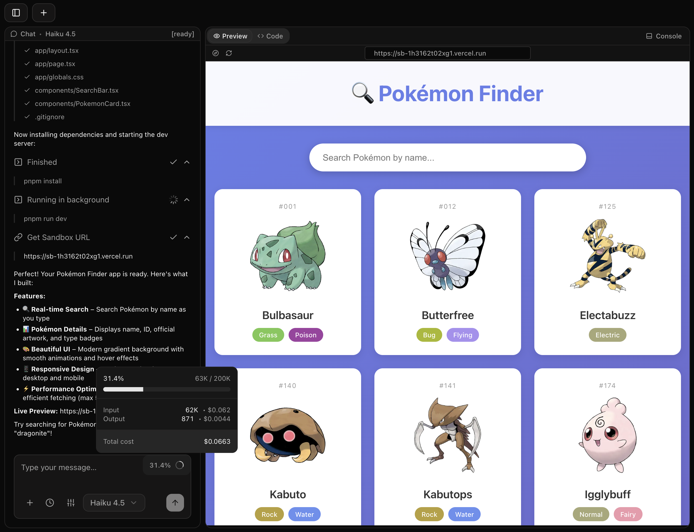

<a href="https://vibestack-code.vercel.app">
  
  <h1 align="center">VibeStack</h1>
</a>

<p align="center">
  End-to-End Coding Platform Built with Next.js, Vercel Sandbox, and AI SDK.
</p>

<div align="center">

> **⚠️ WARNING: This project is currently in early development**  
> **Features and APIs may change. Use at your own risk.**

</div>

<p align="center">
  <a href="#features"><strong>Features</strong></a> ·
  <a href="#built-with"><strong>Built with</strong></a> ·
  <a href="#model-providers"><strong>Model providers</strong></a> ·
  <a href="#deploy-your-own"><strong>Deploy your own</strong></a> ·
  <a href="#running-locally"><strong>Running locally</strong></a>
</p>
<br/>

## Features

- [Monaco Editor](https://microsoft.github.io/monaco-editor/) Integration
  - Full-featured code editor with syntax highlighting, basic autocomplete, and multi-language support
- Real-time File Explorer
  - Tree-view file browser with click-to-select functionality and live file updates
- Live Code Editing
  - Edit files directly in the browser with auto-save and unsaved changes tracking
- Command Execution
  - Run shell commands with real-time output streaming and error monitoring
- Auto Error Detection
  - Intelligent error monitoring that automatically detects and reports issues

## Built with

- [Next.js 16](https://nextjs.org) App Router
  - Advanced routing for seamless navigation and performance
  - React Server Components (RSCs) for server-side rendering and performance improvements
- [AI SDK v5](https://sdk.vercel.ai/docs)
  - Unified API for generating text, structured objects, and tool calls with LLMs
  - Hooks for building dynamic chat and generative user interfaces
- [Vercel Sandbox](https://vercel.com/sandbox)
  - Secure, isolated Linux containers for code execution
  - Real-time preview of generated applications
- [Drizzle ORM](https://orm.drizzle.team)
  - Type-safe SQL ORM with TypeScript support
  - Database migrations and schema management
- [Shadcn/UI](https://ui.shadcn.com)
  - Styling with [Tailwind CSS](https://tailwindcss.com)
  - Component primitives from [Radix UI](https://radix-ui.com) for accessibility and flexibility

## Model providers

This app ships with [Anthropic](https://anthropic.com) provider as the default. However, with the [AI SDK](https://sdk.vercel.ai/docs), you can switch LLM providers to [OpenAI](https://openai.com/), [Ollama](https://ollama.com), [Cohere](https://cohere.com/), and [many more](https://sdk.vercel.ai/providers/ai-sdk-providers) with just a few lines of code.

## Deploy your own

You can deploy your own version of VibeStack to Vercel with one click:

[](https://vercel.com/new/clone?repository-url=https%3A%2F%2Fgithub.com%2Fyour-username%2Fvibestack&env=OPENAI_API_KEY,ANTHROPIC_API_KEY&envDescription=Learn%20more%20about%20how%20to%20get%20the%20API%20Keys%20for%20the%20application&envLink=https%3A%2F%2Fgithub.com%2Fyour-username%2Fvibestack%2Fblob%2Fmain%2F.env.example&demo-title=VibeStack&demo-description=An%20end-to-end%20coding%20platform%20built%20with%20Next.js%2015%2C%20Vercel%20AI%20Cloud%2C%20and%20AI%20SDK.&demo-url=https%3A%2F%2Fvibestack-code.vercel.app)

## Running locally

You will need to use the environment variables [defined in `.env.example`](.env.example) to run VibeStack. It's recommended you use [Vercel Environment Variables](https://vercel.com/docs/projects/environment-variables) for this, but a `.env` file is all that is necessary.

> Note: You should not commit your `.env` file or it will expose secrets that will allow others to control access to your various AI provider accounts.

1. Install Vercel CLI: `npm i -g vercel`
2. Link local instance with Vercel and GitHub accounts (creates `.vercel` directory): `vercel link`
3. Download your environment variables: `vercel env pull`

```bash
bun install
bun dev
```

Your app should now be running on [localhost:3000](http://localhost:3000/).
